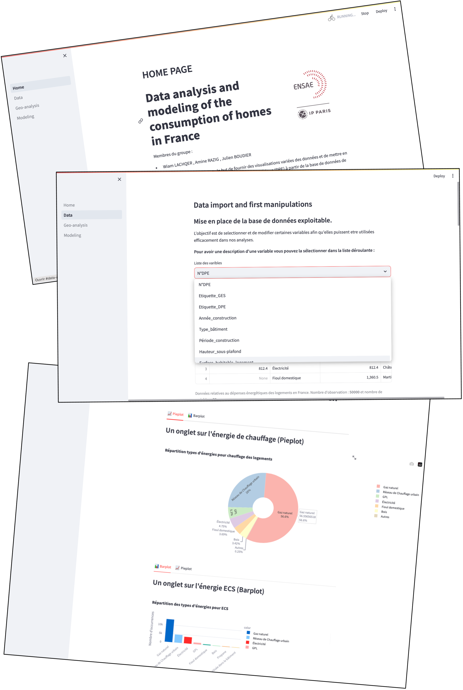
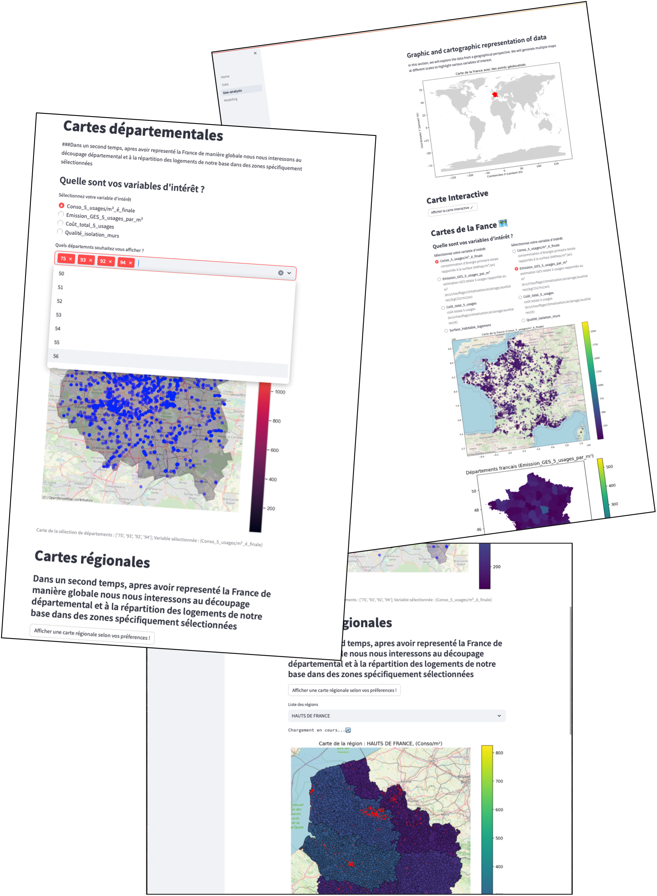
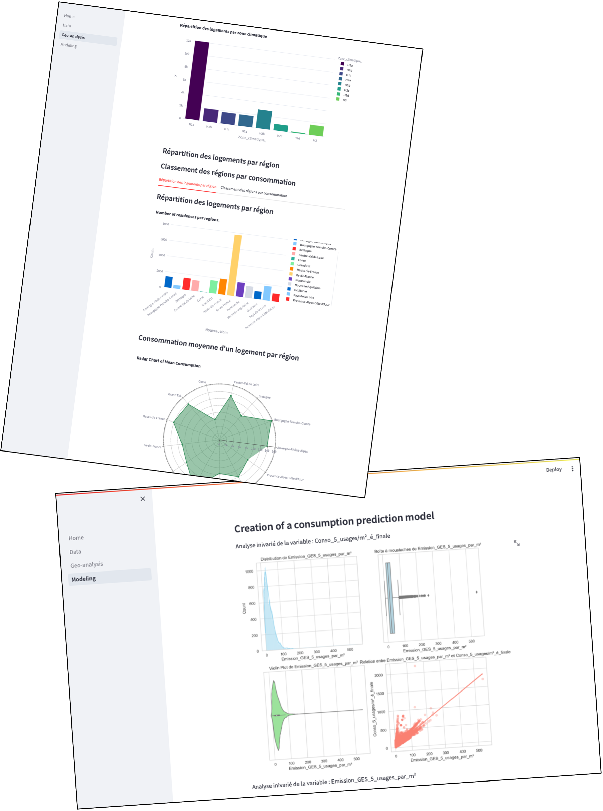

# Projet Data Science - Simulateur de DPE

## ENSAE Paris - 2A

Membres du groupe : 
- Wiam LACHQER , Amine RAZIG , Julien BOUDIER

Ce projet Python a été créé dans le but de fournir des visualisations variées des données et de mettre en place un simulateur de Diagnostic de Performance Energétique (DPE) à partir de la base de données de l'ADEME (Agence de la Transition Écologique).

## Objectifs du Projet

1. **Visualisations de Données :** Le projet propose différentes visualisations des données issues de la base de l'ADEME. Ces visualisations permettent une compréhension approfondie des caractéristiques énergétiques des logements.

2. **Simulateur de DPE :** Un simulateur de DPE a été développé en utilisant les données de l'ADEME. Ce simulateur permet d'estimer la performance énergétique d'un logement en fonction de divers paramètres.
  
3. **WebApp :** La web app utilise streamlit. Pour la lancer, exécuter dans le terminal :
   ```python
   streamlit run Home.py
   

Ce dépôt contient plusieurs dossiers et fichiers : 
- le fichier `data.ipynb` contient le code principal. 
- le dossier `DATA` ne contient pas les données DPE de l'ademe, mais une description des variables et des données géographiques, notamment utilisée dans la web app.
- les fichier .py suivant : eda.py, fetchdata.py sont des scripts python regroupant un ensemble de fonction à importer dans le notebook principal.
    * `eda.py` : fonctions pour l'analyse et la manipulation de données.
    * `fetchdata.py` : fonctions pour l'importation des données.
- `Home.py`, `pages/01_Data.py`, `pages/02_Geo-analysis.py` et `pages/03_Modeling.py` sont les fichiers pour l'application web streamlit
- Le fichier `requirements.txt` contient la liste des dépendances Python nécessaires pour exécuter ce projet. Assurez-vous d'installer ces dépendances avant de lancer le projet.
  ```bash
  pip install -r requirements.txt

### Source des données : https://www.data.gouv.fr/fr/datasets/dpe-logements-existants-depuis-juillet-2021/

## Présentation de l'applications Web : 

   

